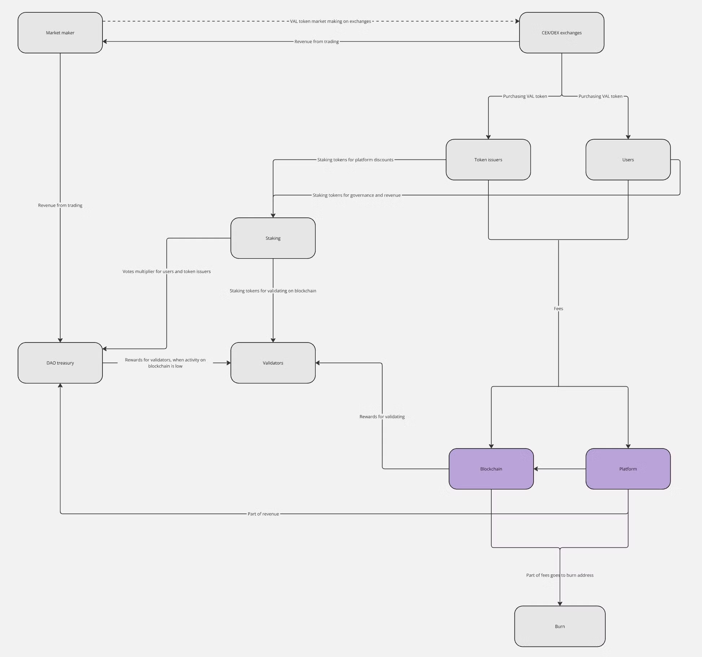

# User Analysis

| **Agents** | **Task they do** | **Their desired behavior** | **Barriers to desired behavior** | **Their undesired behaviors** | **Motivation for undesired behaviours** | **Stimulus mechanisms** | **Probable negative affects of stimulus mechanisms** |
| --- | --- | --- | --- | --- | --- | --- | --- |
| Platform users | • Staking Tokens and Providing Liquidity• Vote in governance• Depositing assets into RWA vaults | • Regular engagement and participation in platform activities• Active involvement in governance voting and community initiatives• Buying RWA pairs or NFTs | • Technical barriers (e.g., complicated interfaces, wallet integrations)• Competition from other DeFi platforms• Concerns about security and integrity (e.g., smart contract vulnerabilities, hacks)• Insufficient liquidity, especially for less liquid assets | • Lack of engagement in governance voting or community initiatives• Creating RFQs with inaccurate or incomplete information• Non-compliance with risk management practices | • Short-term profit motives over long-term sustainability• Market volatility prompting riskier behaviors• Ignoring risk management practices (e.g., overleveraging) | • Incentivizing through rewards and bonuses for participation• Offering user-friendly interfaces and support• Promoting a strong community and secure environment | • Over-reliance on rewards leading to unsustainable behavior• Security features might slow down user interaction• Potential overcomplication of platform with too many features |
| Token holders | • Staking tokens• Buying tokens and investing in the project | • Active token trading• Staking for earnings and rewards | • Weak volumes and poor liquidity• Insufficient rewards and earnings | • Selling tokens, leading to price drops | • Low profits from investment• Negative price action | • Market-making and liquidity provision• Offering competitive staking rewards and bonuses | • Decrease in project’s profits due to high incentive payouts• Potential token inflation |
| Market makers | • Submitting interest in market-making on Valuit platform• Actively quoting• Integrating with ecosystem | • Providing two-sided liquidity• Maintaining tight spreads and precise execution with zero slippage• Contributing to RWA ecosystem growth | • Technical barriers in operating market-making bot• Market volatility and competition• Integration complexities with existing infrastructure | • Lack of participation• Providing one-sided liquidity• Bad market-making practices (e.g., wide spreads, slippage) | • Technical difficulties• Insufficient understanding of platform mechanics• Lack of incentives | • Offering technology tools and lower platform fees• Validating quoting activity and participant verification | • Inefficient resource allocation• Suboptimal trade execution• Dependency on the platform, reducing market maker flexibility |
| Companies/Liquidity providers | • Listing assets on the platform• Engaging in partnerships | • Actively listing assets• Participating in partnerships and contributing to the ecosystem | • Regulatory and compliance challenges• Complexity in asset tokenization• Competition from other platforms | • Delayed or hesitant asset listing• Non-participation in partnerships or collaborations | • Compliance costs• Lack of understanding or familiarity with asset tokenization | • Providing legal and regulatory support• Offering simplified asset tokenization processes• Encouraging partnerships through incentives | • Potential regulatory scrutiny or legal risks• Misalignment between the company's goals and platform incentives |

### **User Integration with Valuit:**

### **Acquisition Phase:**

**Liquidity Provision on Valuit Platform:**

Users can acquire VAL tokens by providing liquidity on the Valuit platform. By participating in liquidity pools and actively quoting on the platform, users contribute to the ecosystem's liquidity and earn VAL tokens as rewards. This promotes active engagement and strengthens the platform's market depth.

**DEXs and CEXs:**

VAL tokens are available for acquisition on both DEXs and CEXs. Users have the flexibility to swap assets or purchase VAL tokens directly using fiat currencies or other cryptocurrencies. This multi-exchange availability increases accessibility and allows users to choose their preferred acquisition method.

**Token Distribution Through Staking:**

Users can acquire VAL tokens as rewards through staking. By staking their tokens, users contribute to the security and stability of the Valuit protocol, earning VAL tokens as incentives. This mechanism encourages long-term commitment and fosters community engagement within the Valuit ecosystem.

### **Token Utilization Options:**

**Governance Participation:**

VAL token holders actively participate in governance processes, including voting on protocol upgrades, fee structures, and incentive distributions. This democratic governance model ensures that platform decisions reflect the preferences of the community, enhancing transparency and promoting decentralization within the Valuit ecosystem.

**Fee Reduction and Rewards:**

Holding VAL tokens grants users access to fee reductions on platform transactions and eligibility for reward distributions. Users can stake their tokens to earn additional rewards or use VAL tokens to pay for transaction fees, which enhances their overall experience and encourages ongoing platform engagement.

**Exclusive Platform Benefits:**

VAL token holders gain access to exclusive benefits tailored for their success, such as educational resources, program incentives, and advanced platform tools. These customized benefits improve the user experience and incentivize continued participation in the Valuit ecosystem.

### **Continuous Engagement:**

**Long-Term Staking and Governance Participation:**

Users engage in long-term staking of VAL tokens to access enhanced benefits and governance rights within the Valuit ecosystem. Active participation in governance processes ensures that users have a voice in shaping the platform's future, fostering a sense of ownership and accountability within the community.

**Utilization of Platform Tools and Features:**

Users continuously interact with the Valuit platform by using its tools and features to execute trades, manage positions, and participate in RFQs. The platform's user-friendly interface and comprehensive dashboard enable seamless interaction, which enhances user satisfaction and promotes ongoing engagement.

**Feedback and Iteration:**

Users regularly provide feedback through surveys and community forums, which drives continuous improvement of the platform's features, incentives, and tools. By collaborating closely with the community, Valuit ensures that user needs and preferences are met, creating a dynamic and responsive environment for platform development and enhancement.

