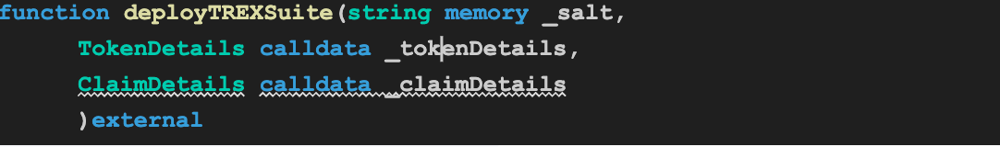

# Token Factory Contract
**Contract Functions:**

1. **deployTREXSuite**

**Signature**

**Working:**

Deploys new token suite contracts.

| **Parameters** | **Type** | **Description** |
| --- | --- | --- |
| _salt | string | Unique identifier for token deployment |
| _tokenDetails | struct | Struct containing token-related settings |
| _claimDetails | struct | Struct containing claim-related settings |
1. **setImplementationAuthority**

**Signature**

**Working:**

Sets a new Implementation Authority address for the contract

| **Parameters** | **Type** | **Description** |
| --- | --- | --- |
| implementationAuthority_ | address | Unique identifier for token deployment |